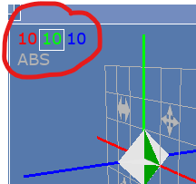
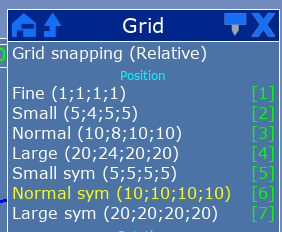
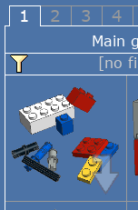
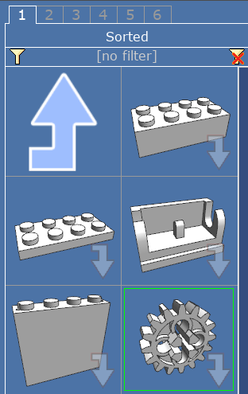
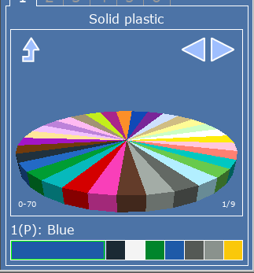

# Computer Aided Design

## Rationale

Working exclusively with physical LEGOs can be very limiting. Most of you only have access to the robotics and Technic parts when you come to FLL meetings on Sundays. Even then, parts are limited and it takes time to dig through the pieces and find the part you're looking for.

What happens when it's time to clean up? Will you be able to find your assembly again next week? If you can't make it to Robotics next week, will someone else find it, and not realizing it was something you were working on, take a part off of it that they need?

What about designs we want to save for a long time? Should we tie up valuable parts just so that we don't forget how a robot went together?

One of our limitations as a community-based program that only meets once or twice a week is that we simply don't have the _time_ to work on our designs that home- or school-based teams that can meet more often do. How can we work around that? Wouldn't it be nice to be able to email design drawings to your teammate, or even work on them together over Zoom?

Drawing robot ideas by hand is an option, but it's not able to be very precise or detailed. Computer-aided design lets us explore ideas quickly, share them over email, preserve them on Git repositories, and spend our limited time with the LEGO pieces reifying ideas that we've already carefully considered and refined.

## Limitations

When you first start assembling LEGO pieces inside the computer, you won't really know how structurally sound or easily constructed your designs are. It's certainly possible to create an assembly in LDCad with no collisions that is nevertheless impossible to construct with actual LEGO pieces. And I've created designs before that I assumed would work a certain way, that turned out to be flimsy and not function well at all.

It takes a lot of trial and error to make better designs, but even when you're experienced at it, you'll still sometimes make mistakes.

The computer can't really make sure your design will function as intended. What it can do for you is give you a way to record and communicate your ideas.

## Programs Used

### LDCad/LDraw

#### Getting Started

The best way to get started with [LDCad](http://www.melkert.net/LDCad) is to download the complete [LDraw All-In-One Installer](https://www.ldraw.org/article/104.html). This contains the software along with the parts models. The strength of this program is building LEGO components quickly. LDCad is available for Windows and Linux.

#### LDCad Setup

One of the first things you're going to want to do in LDCad is change the grid stepping to 10-10-10-10. That works best for Technic. Other settings might work better for bricks.

#### Find Parts

1. The best way to find parts is to click on Library Sorted by Function, which looks like this

2. From there, you can choose Technic parts

#### Apply Colors

Your model will look more realistic and be easier to understand if you apply the same colors as the parts we have in real life. You can either choose a color before taking a part from the library, or pick a color while you have a part selected, and then click on the larger color rectangle to apply it to the selected part.

#### Learn more through YouTube

Those are the bare basics, but if you're stuck, you might have more luck if you watch a video. Try [this one](https://www.youtube.com/watch?v=-vxM2vLiBRs) to start.

### Bricklink Studio

Bricklink Studio (sometimes styled stud.io) has great tools for generating build instructions with parts lists. It also does great ray-trace renderings, but they're very slow to generate. It is available [here](https://www.bricklink.com/v3/studio/download.page). Studio is available for Windows and Mac OS.

You can also do the initial designs in this program, but it works differently from LDCad. You'll have to experiment with it to decide whether you like it better or not.