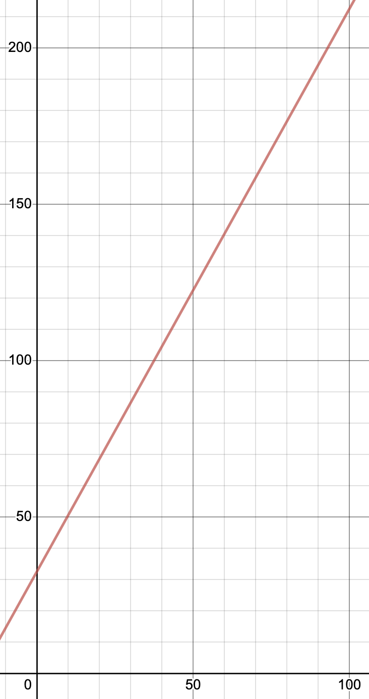
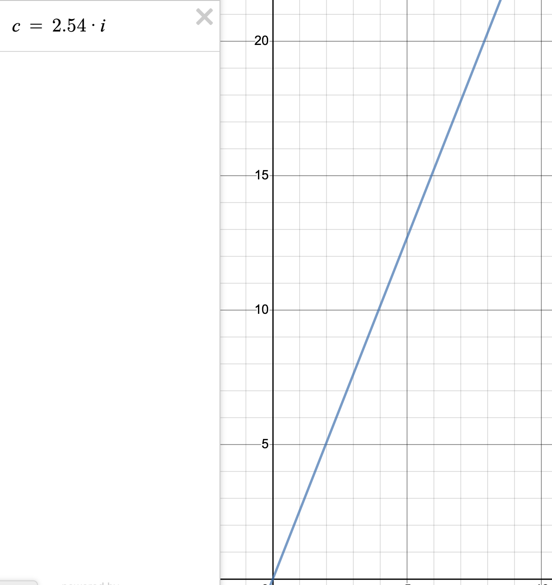

# Linear functions

## Relationships Between Variables

It is often the case that two variables are **functionally related** to each other, meaning that they vary together in a predictable way, and it can be described by a mathematical function. For example, if someone gets payed a certain number of dollars per hour, the amount they make in a week is functionally related to the hours they work.

One of the simpler kinds of functional relationships that two variables could have between each other is linear. In a linear relationship, the formula is allowed to have one multiplication and an addition operation. The addition is optional because you can just add 0, and subtraction is allowed too because you can add a negative number. Likewise, the multiplication part can be a division because you can multiply by one over the number you want to divide by. The reason it's called linear is that when plotted on a graph, a formula with only a multiplication and a division makes a straight line.

## Examples

So what does this look like in practice? Consider how degrees celsius and degress fahrenheit are related to each other. The formula for getting °C from a given °F is `celcius = (fahrenheit - 32) * 5 / 9`. You can just as easily go the other direction and get °F from °C with this formula `fahrenheit = (9 / 5) * celcius + 32`. Whenever you have two units for measuring the same physical property, they'll almost always be related linearly. Another example is the formula for getting cm from inches is `cm = 2.54 * in`. These two examples also illustrate two different types of linear relationships: **proportional** and **non-proportional**. Notice that there's no addition operation when converting between inches and centimeters. Inches are proportional to centimeters because 0 means the same thing in both units. But fahrenheit is not directly proportional to celsius because there's a 32 degree offset: the freezing temperature of water in °C is 0, but the same temperature in °F is 32.

## Graphing the releationships

### Celcius to Fahrenheit

### Inches to Centimeters

There's a great free online graphing calculator called Desmos. I used it to create the images above. You can find it [here](https://www.desmos.com/calculator).

In both of these graphs, there's a number line along the bottom called the **x-axis**, and another number line running up the side called the **y-axis**. Traditionally, the x-axis is used for the number you're putting into the formula (the **independent variable**) and the y-axis is used for the number you're getting out of the formula (the **dependent variable**, so-called because it depends on the independent variable). The first graph plots the formula for going from °C to °F. You can see that at 100°C on the x-axis, the line is just above 200 on the y-axis. In fact, it's at 212°F, the boiling point of water.

Any point within the graph can be denoted by its coordinates, written as an ordered pair of numbers in parentheses, with the x value listed first. So the boiling point of water is (100, 212) and the freezing point is (0, 32). The point where the x-axis and they y-axis cross, (0, 0) is called the **origin**. Notice that the graph of the line for the formula to convert from inches to centimeters intersects the origin. That's another way to see that inches are proportional to centimeters. On the temperature graph, the freezing point happens to be where the line crosses the y-axis. The word for where a line crosses the y-axis is the **y intercept**.

Another property of lines is their **slope**, or steepness. The larger of a number you multiply by, the steeper the line will be. Slope is the fraction of rise / run. Rise is the change in y; run is the change in x. So the temperature slope of 9/5 means that for every increase of 5°C, there's an increase of 9°F. 2.54 expressed as a fraction is 127/50, so for every 50 inches, there are exactly 127 centimeters, which is also their proportion.

The most common way you'll see linear formulas written is called **slope-intercept form**: _y=mx+b_ where m is the slope and b is the y-intercept. Notice that the formula for converting °C to °F is already in slope-intercept form.

## Lines From Points

### Determine Linearity

Sometimes, you'll have a list of points, or a table of observations, and you might be wondering if it's a linear relationship. [This video](https://www.youtube.com/watch?v=R8L1A0klAQY&t=197s) shows how to figure that out.

### Exercise

After you watch the video, take a look at the FLL 2020-2021 rulebook for the Replay challenge. There's a table listing the number of precision tokens left and the number of precision points awarded. Is the relationship linear?

### Formula From Points

One way to exactly define a line besides giving the formula is to list just two points. The freezing and boiling points of water discussed above are sufficient to work out the formula for the line that passes through both points. Slope is rise over run, so you just subtract the y values and divide that by the difference in the x values. So in this case, (212 - 32) / (100 - 0) = 180 / 100. You can simplify a fraction by dividing the numerator and denominator by the same number. 180 / 20 = 9 and 100 / 20 = 5, so the slope simplifies to 9/5. Once you have the slope, you can substitute it for m in the y=mx+b formula, so y=9x/5+b. Now, to get the y intercept, _b_, plug in either of the 2 points for x and y. I'll be plugging in (100, 212).

* 212=9*100/5+b
* 212=180+b
* 212-180=b
* 32=b

So the formula is y=9x/5+32. But sometimes it's just handed to you: one of the points in this case happens to be (0, 32), so 32 is the y intercept by definition.
